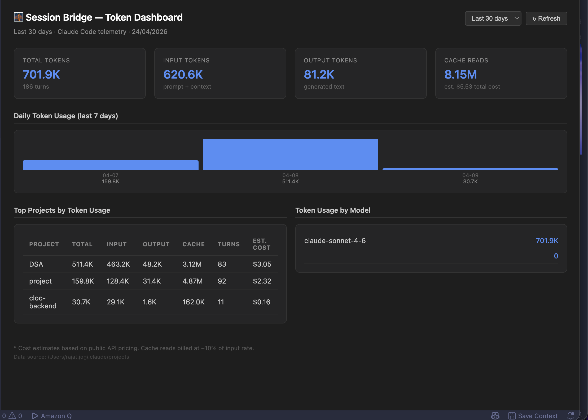
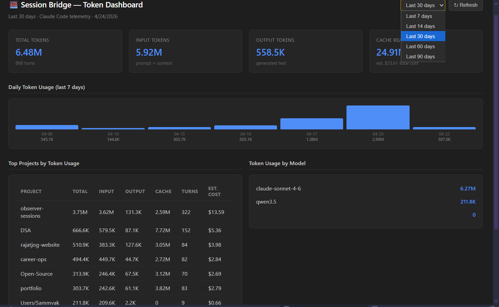

<div align="center">

# 🌉 Session Bridge AI

### Never lose your AI coding context again.


[](https://github.com/sponsors/RJ-Gamer)

</div>

---

## The Problem

You're deep into solving a problem with Claude Code. Credits run out — no warning, mid-sentence. You switch to Gemini. Now you have to explain everything again from scratch.

**Session Bridge AI fixes this.**

It maintains a running `SESSION.md` in your project — automatically capturing git diffs, open files, and your progress notes — always ready to hand off to any AI tool so you continue exactly where you left off.

---

## Features

- **🤖 Multi-provider** — works with Gemini, Claude, and OpenAI
- **📂 Git diff capture** — automatically includes recent code changes
- **👁️ Open files capture** — includes context from your currently open files
- **⚡ Auto-save** — context saved automatically every N logged messages
- **💾 Manual save** — save anytime via status bar button or command palette
- **📋 One-click handoff** — copies full handoff prompt to clipboard instantly
- **📊 Token Dashboard** — visualize Claude Code token usage and costs by project
- **🧠 Model recommendation** — SESSION.md suggests Haiku/Sonnet/Opus based on task complexity
- **⏰ Peak hour warning** — alerts during high-demand Claude hours to save context early
- **🔒 Secure key storage** — API keys stored in VS Code secret storage, never in plaintext
- **📦 Persistent buffer** — context survives VS Code restarts
- **⚙️ Configurable threshold** — set auto-save threshold to any value (minimum 2)
- **💰 Budget alerts** — set daily/weekly spend limits with warnings at 50%, 80%, and 100%
---

## Setup

**1. Install the extension**

Search `Session Bridge AI` in VS Code Extensions or install from the [Marketplace](https://marketplace.visualstudio.com/items?itemName=RajatJog.session-bridge-ai).

**2. Get a free API key**

| Provider | Free Tier | Link |
|----------|-----------|------|
| Gemini | ✅ Yes | [Google AI Studio](https://aistudio.google.com/apikey) |
| Claude | ❌ Credits needed | [Anthropic Console](https://console.anthropic.com/settings/keys) |
| OpenAI | ❌ Credits needed | [OpenAI Platform](https://platform.openai.com/api-keys) |

**3. Set your provider and API key**

```
Ctrl+Shift+P → Session Bridge: Set AI Provider & API Key
```

---

## Commands

| Command | Shortcut | Action |
|---------|----------|--------|
| `Session Bridge: Log Message` | `Ctrl+Alt+M` | Log what you're currently working on |
| `Session Bridge: Save Context Now` | `Ctrl+Alt+S` | Generate/update SESSION.md immediately |
| `Session Bridge: Start New Session` | `Ctrl+Alt+N` | Copy full handoff prompt to clipboard |
| `Session Bridge: Set AI Provider & API Key` | — | Set provider and API key |
| `Session Bridge: Clear Buffer` | — | Clear the current message buffer |
| `Session Bridge: Open Token Dashboard` | — | View token usage and cost analytics |
| `Session Bridge: Check Budget Status` | — | Manually refresh budget status |
Or click **`Save Context`** in the bottom right status bar.

---

## Token Dashboard

Session Bridge AI reads Claude Code's local telemetry files to show you exactly how many tokens you're burning and what it costs.

```
Ctrl+Shift+P → Session Bridge: Open Token Dashboard
```





**What you'll see:**
- Total tokens, input tokens, output tokens, cache reads
- Estimated cost per project and overall
- Daily usage bar chart with date range selector (7/14/30/60/90 days)
- Per-project breakdown with turn counts
- Model usage breakdown

**Requirements:** Claude Code must be installed and used at least once.

**Custom installation:** If you installed Claude Code in a non-standard location, set the `CLAUDE_CONFIG_DIR` environment variable.

**Custom pricing:** Override token costs in settings:
```json
"session-bridge.customPricing": {
  "claude-sonnet-4-6": { "input": 3.0, "output": 15.0, "cacheRead": 0.30 }
}
```

---

## Settings

| Setting | Default | Description |
|---------|---------|-------------|
| `session-bridge.provider` | `gemini` | AI provider — `gemini`, `claude`, or `openai` |
| `session-bridge.messageThreshold` | `5` | Messages before auto-save (min 2) |
| `session-bridge.captureGitDiff` | `true` | Include git diff in context |
| `session-bridge.captureOpenFiles` | `true` | Include open files in context |
| `session-bridge.customPricing` | `{}` | Custom token pricing per model |
| `session-bridge.dailyBudget` | `0` | Daily spend budget in USD. 0 = disabled |
| `session-bridge.weeklyBudget` | `0` | Weekly spend budget in USD. 0 = disabled |
| `session-bridge.budgetAlerts` | `true` | Enable or disable budget alert notifications |
---

## Workflow

1. Start working with Claude Code / Codex / Gemini / Amazon Q
2. Log progress every few exchanges:
3. Ctrl+Alt+M → type what you're working on
Credits die unexpectedly? → `Ctrl+Alt+N` — copies full handoff prompt to clipboard → Paste into your next AI tool → Continue exactly where you left off

---

## Example SESSION.md Output

```markdown
## Problem
Implement JWT-based authentication for a REST API

## Approach
Express.js + PostgreSQL, bcrypt for password hashing, JWT for stateless auth

## Completed
- POST /register — complete
- POST /login — complete, returns access + refresh tokens
- DB schema — finalized

## In Progress
- GET /me endpoint — needs auth middleware

## Next Steps
- Complete auth middleware
- Add token refresh endpoint
- Write integration tests

## Key Decisions
- Chose JWT over sessions for statelessness
- Refresh tokens stored in DB for revocation support

## Files Modified
- src/routes/auth.ts — login and register routes
- src/middleware/authenticate.ts — JWT verification

## Recommended Model
Claude Sonnet — standard development task involving multiple
files and API design. Haiku would suffice for simple edits.

## How To Continue
Complete the GET /me route using the authenticate middleware.
Then add POST /auth/refresh for token renewal.

---
Provider: gemini
Last updated: 4/23/2026, 2:56:27 PM
```

---

## Requirements

- VS Code 1.116.0 or higher
- API key for at least one supported provider
- Claude Code (optional, for Token Dashboard)

---

## Privacy

Session data including code snippets and git diffs is sent to your chosen AI provider to generate summaries. API keys are stored in VS Code secret storage and never written to disk. Token Dashboard data is read locally and never transmitted anywhere.

---

## Contributing

Pull requests are welcome. For major changes please open an issue first.

1. Fork the repo
2. Create your branch (`git checkout -b feature/my-feature`)
3. Commit (`git commit -m 'feat: add my feature'`)
4. Push (`git push origin feature/my-feature`)
5. Open a Pull Request

---

## Support

[](https://github.com/sponsors/RJ-Gamer)

---

<div align="center">

Made with ❤️ by [RJ-Gamer](https://github.com/RJ-Gamer)

</div>
